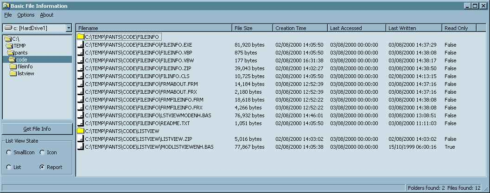



## File Info

### Description

Following a number of requests for information, suggestions for improvements

I have spent some time updating this little application with some improved functionality.

It is still primarily a little tutorial on the useful nature of the FileSystemObject wrapped

up in the scrrun.dll, with some useful content on the nature of a class: setting, getting

and populatinf attributes. Now includes some useful interface guidance on menu setting

option buttons and ListView control handling.

- File information is now viewed in a resizable ListView control

- The ListView Control supports multiple views

- Columns in the ListView can be sorted by clicking on the columnheader

- Columns in the ListView can dragged to change order
 
### More Info
 
Not Applicable

Your PC should have scrrun.dll installed and registered.

             |
---                |---
**Submitted On**   |2000-08-03 15:38:18
**By**             |[Scott Brown](https://github.com/Planet-Source-Code/PSCIndex/blob/master/ByAuthor/scott-brown.md)
**Level**          |Intermediate
**User Rating**    |3.7 (26 globes from 7 users)
**Compatibility**  |VB 5\.0, VB 6\.0, ASP \(Active Server Pages\) 
**Category**       |[Complete Applications](https://github.com/Planet-Source-Code/PSCIndex/blob/master/ByCategory/complete-applications__1-27.md)
**World**          |[Visual Basic](https://github.com/Planet-Source-Code/PSCIndex/blob/master/ByWorld/visual-basic.md)
**Archive File**   |[CODE\_UPLOAD8554832000\.zip](https://github.com/Planet-Source-Code/scott-brown-file-info__1-10351/archive/master.zip)

